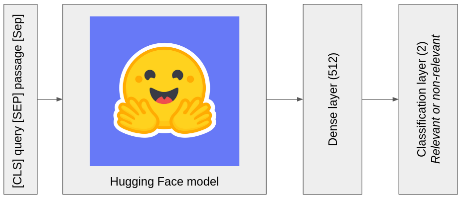
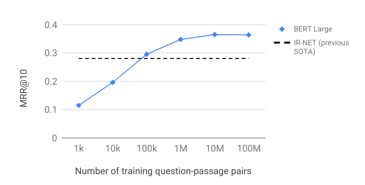

**To do:**
- [ ] create a section with the code to reproduce the MRR scores
- [ ] train with other Hugging Face model like Electra
- [ ] continue the training with more training pairs

# Re-ranking task using MS MARCO dataset

Code for train a re-ranking model on MS MARCO dataset using [Hugging Face](https://huggingface.co/transformers/) library.

| Table of contents |
| ----------------- |
| [Task](#task) |
| [My model](#my-model) |
| [Results](#results) |
| [Getting started](#getting-started) |

## Task

Description from the [offical repository](https://github.com/microsoft/MSMARCO-Passage-Ranking) of the task:

>Given a query q and a the 1000 most relevant passages P = p1, p2, p3,... p1000, as retrieved by BM25 a succeful system is expected to rerank the most relevant passage as high as possible. For this task not all 1000 relevant items have a human labeled relevant passage. Evaluation will be done using MRR

All the data are available on the [official repository](https://github.com/microsoft/MSMARCO-Passage-Ranking) of the task.

The leaderboard is availaible on this [link](https://microsoft.github.io/msmarco/#ranking).

## My model

The model is composed of a Hugging Face transformer model, a dense layer and a classification layer. The idea is to compare several models of transformers for the re-ranking task.



## Results

These are the results and model weights after a training with parameters :

  - ``learning_rate = 3e-6``
  - ``batch_size = 6``
  - ``num_samples = 50000`` (number of triples) (correspond to 100000 training query-passage pairs)

It tooks around 6 hours on google colab GPU.

| Model | ``bert-large-cased`` | ``albert-large-v2`` | ``roberta-large`` |
| --- | ----------- | --- | ----------- |
| Classification accuracy | 0.90 | 0.91 | 0.93 | 
| @MRR 10 | 0.278 | 0.291 | 0.303 |
| Saved weights | [.h5 file](https://drive.google.com/open?id=1-_UWYwclkSPrngxkZz4C2pRcwSddqDbC) | [.h5 file](https://drive.google.com/open?id=1-827HbZsLhPLI6NYclLsJ1VNv36Bd9WN) | [.h5 file](https://drive.google.com/open?id=107VGIUS8jrvBFhe4tipw4SQ7t0s1-Cjw) |

The MRR scores obtained are below those of the leaderboard. We can explain this by the low number of training steps. By comparing with the evolution of the MRR score according to the number of training pairs for ``bert-large-cased`` (see figure below from this [paper](https://arxiv.org/pdf/1901.04085.pdf)), my result corresponds. We can assume that with more training step my final MRR score for ``bert-large-cased`` will correspond to that obtained in this paper ([paper](https://arxiv.org/pdf/1901.04085.pdf) [github](https://github.com/nyu-dl/dl4marco-bert)). In addition ``roberta-large`` seems to have a better result so it would be interesting to continue the training with more training pairs.
 


>[Nogueira, Rodrigo and Cho, Kyunghyun. "Passage Re-ranking with BERT." *arXiv preprint arXiv:1901.04085.* 2019](https://arxiv.org/pdf/1901.04085.pdf)

## Getting started

### Installation

#### Create a virtual environnement and activate it:

```
python3 -m venv msmarco_env
source msmarco_env/bin/activate
```


#### Install all dependencies:

```
pip install -r requirements.txt
```


#### Download data:

You can download preprocess data for MRR evaluation and training on a small part of the dataset available [here](https://drive.google.com/open?id=1-LZcCSVwejkdMg_9rnteUi2kHBZT-NP_). Then you just have to put files into corresponding folder in ``data/``

If you want all the dataset, refer to the [official depot](https://github.com/microsoft/MSMARCO-Passage-Ranking)

For reproduce the data preprocessing refer to this [repository](https://github.com/castorini/anserini/blob/master/docs/experiments-msmarco-passage.md). It contains most of the necessary steps.

### Training

[](https://colab.research.google.com/drive/1WZpJ7ircYwCf-csTruNCW7b_Q5JnNTYt)

```
python train.py --model_name 'roberta-large' \
                --train_path "data/train/triples.train.tiny.tsv" \
                --batch_size 6 \
                --num_samples 50000 \
                --learning_rate 3e-6 \
                --n_queries_to_evaluate 1000
```

To see full usage of ``train.py``, run ``python train.py --help``.

### Use pre-trained models

[](https://colab.research.google.com/drive/1ZjUHaIWwWkcV5MWrwqLoLgB8bc8ddmAu)

#### Download saved weights

We can download .h5 file (link above) for the model you want to use. Then put the .h5 file into ``model/saved_weights/`` folder.

#### Load weights 

Here is an example of use with ``roberta-large``:

```python
''' import '''
import tensorflow as tf
import numpy as np
from transformers import TFAutoModel, AutoTokenizer
from model.scorer import Scorer

''' parameters '''
model_name = 'roberta-large'
max_length = 256
num_classes = 2
weights_path = 'model/saved_weights/model_roberta-large_mrr_0.303.h5'

''' load model '''
tokenizer = AutoTokenizer.from_pretrained(model_name)
model = Scorer(tokenizer, TFAutoModel, max_length, num_classes)
model.from_pretrained(model_name) # need to optimize this step by loading config instead of weights
model(tf.zeros([1, 3, 256], tf.int32))
model.load_weights(weights_path)
model.compile(run_eagerly=True)

''' score passages '''
query = 'query'
passages = ['relevant passage', 'non-relevant passage']
scores = model.score_query_passages(query, passages, 2)
print(scores) 
# [1, 0]
```

### Bonus : use web, re-ranking and summarization to generate a wiki style articles

[](https://colab.research.google.com/drive/1VyjO0rbWowOckzyfIIuxjBlO1qUtevOF#scrollTo=V5qoECBryCQk)

## License
[MIT](https://choosealicense.com/licenses/mit/)
